# Business Insights

> **Retail Analytics Intelligence Platform**  
> Business-focused findings from the Gold-layer star schema (`fact_sales`, `dim_customers`, `dim_products`).

---

## 1. Executive Summary

The analysis shows a business heavily concentrated in **Bikes**, with strong geographic contribution from the **United States and Australia**, relatively balanced revenue between male and female customers, and low dependence on a small number of customers.

### Key Findings

| Area | Finding | Business Implication |
|---|---|---|
| Revenue | **Bikes generate 96.46%** of revenue | Strong core category, but high category concentration risk |
| Profit | Bikes generate **$11.11M** profit | Bikes are the primary profit engine |
| Margin | Accessories have the highest margin at **62.79%** | Strong opportunity for margin expansion through accessories |
| Subcategories | **Road Bikes ($14.52M)** lead revenue | Road Bikes are the strongest product group |
| Geography | **United States: $9.16M** revenue | US is the largest revenue market |
| Orders | US has **9,230 orders** | US leads transaction volume |
| Customer mix | Male and female revenue is almost evenly split | Avoid overly gender-specific strategy |
| AOV | Australia has the highest AOV: **$1,348.62** | Strong premium/bundle opportunity |
| Segmentation | VIP, High Value, Regular, Low Value and At Risk segments are present | Enable targeted retention and growth campaigns |
| Concentration | Top 10 customers contribute only **0.45%** of revenue | Low individual-customer concentration risk |
| YOY | 2013 shows strong growth across major categories and markets | 2013 was the strongest observed full-year period |
| Data quality | 2014 revenue is extremely low across markets | 2014 appears incomplete and requires caution |

---

# 2. Revenue & Profitability

## 2.1 Revenue by Category

| Category | Revenue | Revenue Share |
|---|---:|---:|
| Bikes | $28,316,272 | **96.46%** |
| Accessories | $699,997 | 2.38% |
| Clothing | $339,716 | 1.16% |

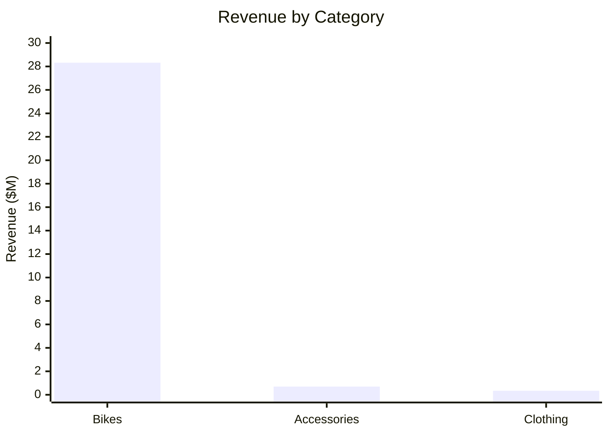

### Insight

**Bikes dominate the portfolio**, contributing 96.46% of total revenue.

This creates both a strength and a risk:

- **Strength:** a very strong core category.
- **Risk:** revenue is highly dependent on Bikes.
- **Opportunity:** Accessories and Clothing can provide diversification and cross-sell growth.

---

## 2.2 Profit by Category

| Category | Profit |
|---|---:|
| Bikes | $11,109,565 |
| Accessories | $439,510 |
| Clothing | $136,682 |

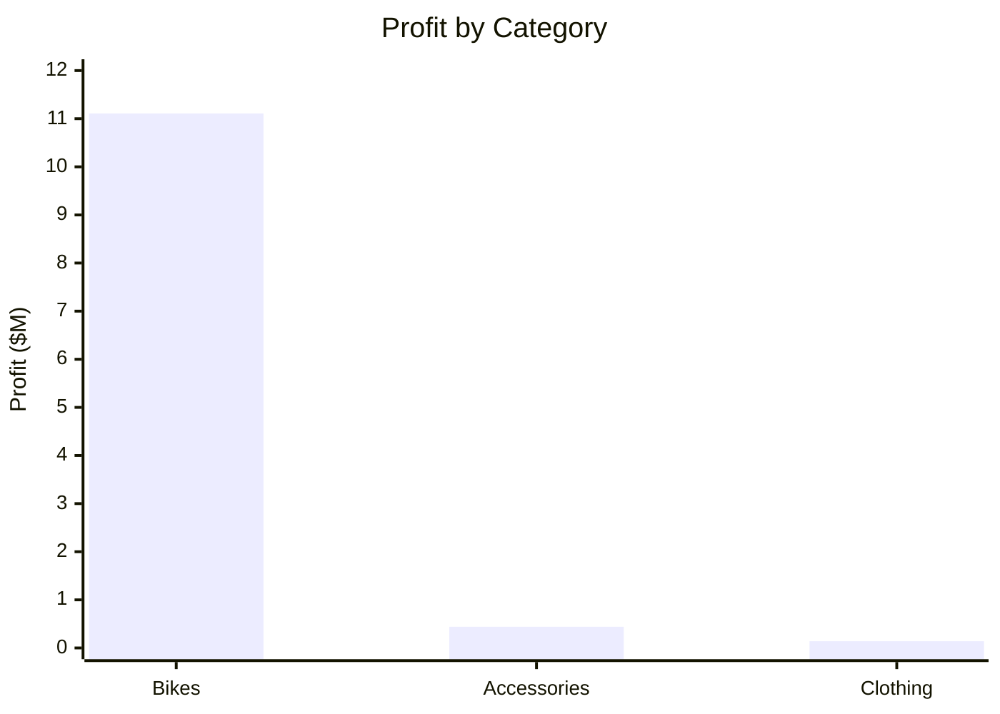

Bikes generate the overwhelming majority of absolute profit because of their large revenue base.

---

## 2.3 Profit Margin by Category

| Category | Profit Margin |
|---|---:|
| Accessories | **62.79%** |
| Clothing | 40.23% |
| Bikes | 39.23% |

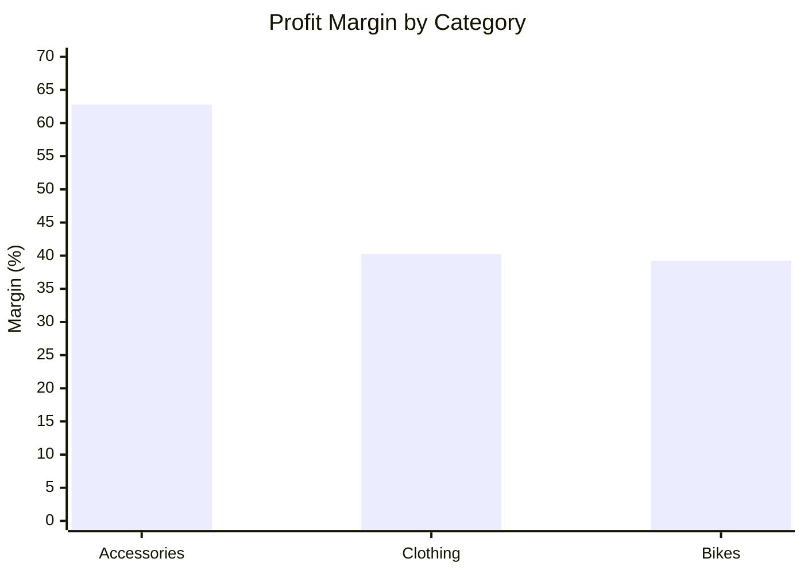

### Key Insight

Accessories have the **highest margin at 62.79%**, despite representing only 2.38% of revenue.

### Business Recommendation

Increase accessory visibility through:

- Bike + accessory bundles
- Checkout recommendations
- Cross-selling tires, helmets, bottles, racks and maintenance products
- Customer-specific accessory recommendations

---

# 3. Product & Subcategory Performance

## 3.1 Revenue by Subcategory

| Rank | Subcategory | Revenue |
|---:|---|---:|
| 1 | Road Bikes | $14,519,438 |
| 2 | Mountain Bikes | $9,952,254 |
| 3 | Touring Bikes | $3,844,580 |
| 4 | Tires and Tubes | $244,634 |
| 5 | Helmets | $225,330 |
| 6 | Jerseys | $173,084 |
| 7 | Shorts | $71,330 |
| 8 | Bottles and Cages | $56,849 |
| 9 | Fenders | $46,662 |
| 10 | Hydration Packs | $40,315 |

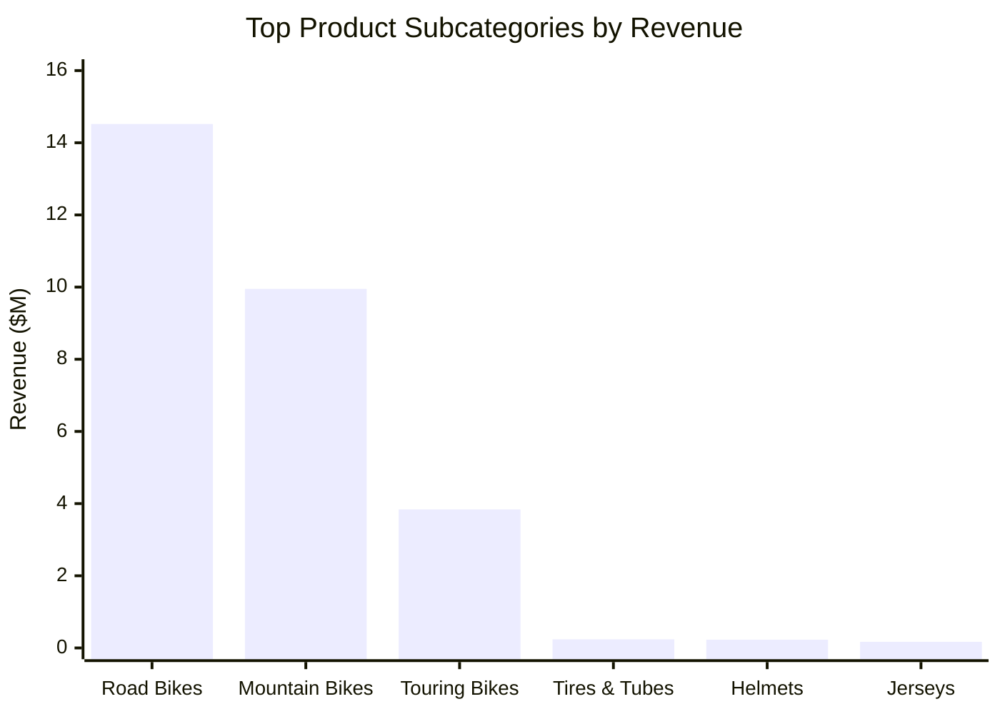

### Insight

**Road Bikes are the strongest subcategory**, followed by Mountain Bikes and Touring Bikes.

The three major bike subcategories account for almost all category revenue.

---

# 4. Customer Analysis

## 4.1 Revenue by Gender

| Gender | Revenue |
|---|---:|
| Female | $14,804,068 |
| Male | $14,522,228 |
| n/a | $29,689 |

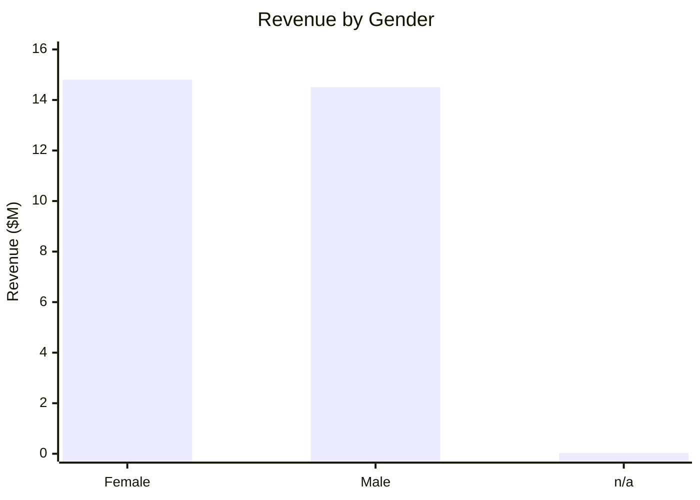

Revenue is almost evenly split between male and female customers.

### Business Recommendation

Do not build the overall marketing strategy around one gender. Both segments represent substantial revenue opportunities.

---

## 4.2 Orders by Gender

| Gender | Orders |
|---|---:|
| Male | 13,906 |
| Female | 13,737 |
| n/a | 16 |

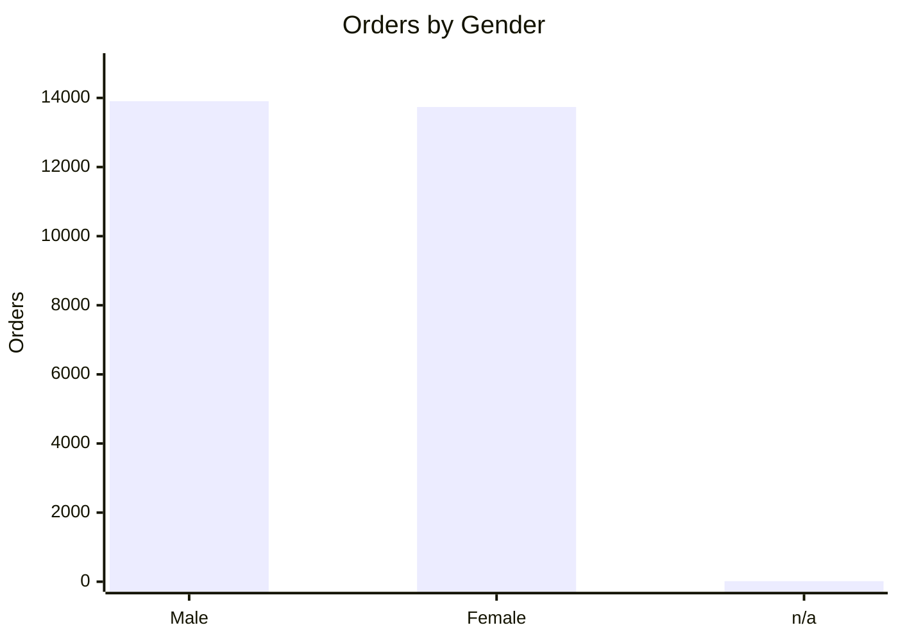

Order distribution is also highly balanced, supporting the revenue finding.

---

# 5. Geographic Performance

## 5.1 Revenue by Country

| Rank | Country | Revenue |
|---:|---|---:|
| 1 | United States | $9,162,311 |
| 2 | Australia | $9,060,058 |
| 3 | United Kingdom | $3,391,351 |
| 4 | Germany | $2,894,066 |
| 5 | France | $2,643,741 |
| 6 | Canada | $1,977,638 |
| 7 | n/a | $226,820 |

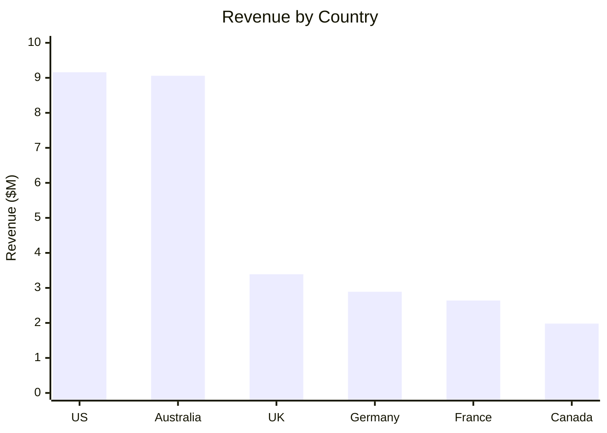

### Insight

The **United States and Australia are the two largest revenue markets**, each generating approximately $9M.

Together they contribute roughly two-thirds of reported country revenue.

---

## 5.2 Orders by Country

| Country | Orders |
|---|---:|
| United States | **9,230** |
| Australia | **6,718** |
| Canada | 3,375 |
| United Kingdom | 3,031 |
| France | 2,484 |
| Germany | 2,484 |
| n/a | 337 |

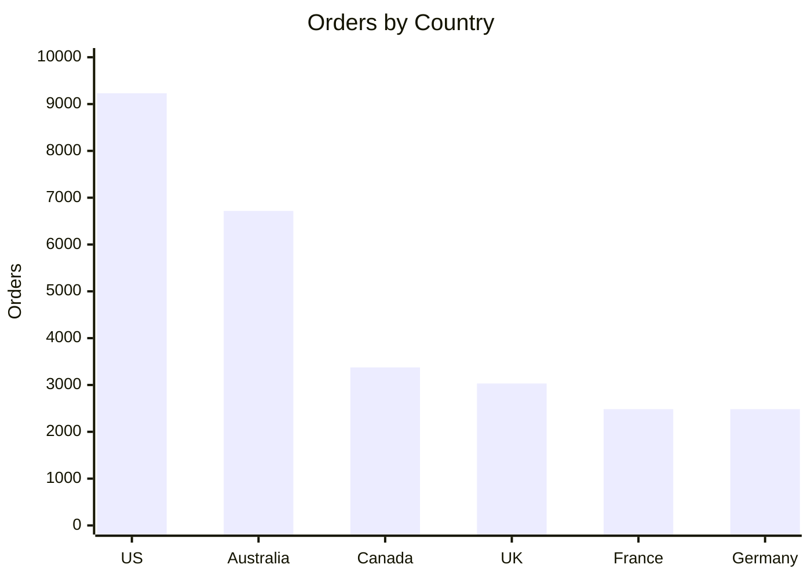

---

## 5.3 Average Order Value by Country

| Country | AOV |
|---|---:|
| Australia | **$1,348.62** |
| Germany | $1,165.08 |
| United Kingdom | $1,118.89 |
| France | $1,064.31 |
| United States | $992.67 |
| Canada | $585.97 |

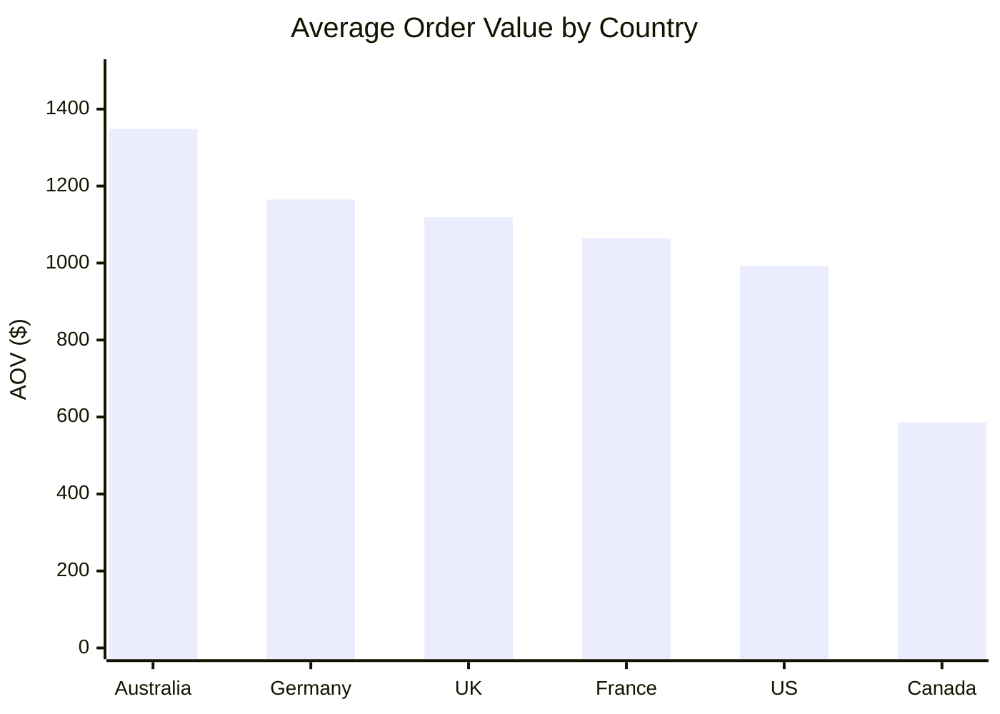

### Key Insight

Australia has the **highest AOV ($1,348.62)**, while Canada has the lowest ($585.97).

### Business Recommendation

Use AOV-specific strategies:

- **Australia:** premium products and bundles
- **Canada:** cross-selling and upselling
- **US:** retention and high-volume campaigns

---

## 5.4 Profit by Country

| Country | Profit |
|---|---:|
| United States | $3,715,394 |
| Australia | $3,542,133 |
| United Kingdom | $1,342,468 |
| Germany | $1,147,605 |
| France | $1,041,862 |
| Canada | $811,661 |
| n/a | $84,634 |

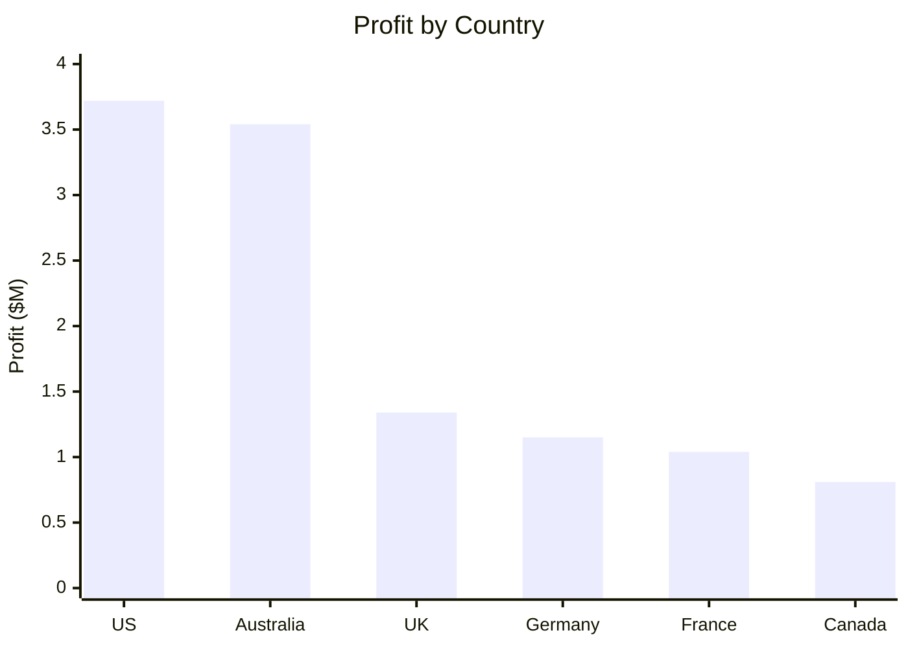

The US and Australia are both revenue and profit leaders.

---

# 6. Customer Age Analysis

## Revenue by Age Group

| Age Group | Revenue |
|---|---:|
| 35–44 | **$11,102,069** |
| 45–54 | $7,274,921 |
| 25–34 | $6,395,498 |
| 55+ | $4,529,542 |

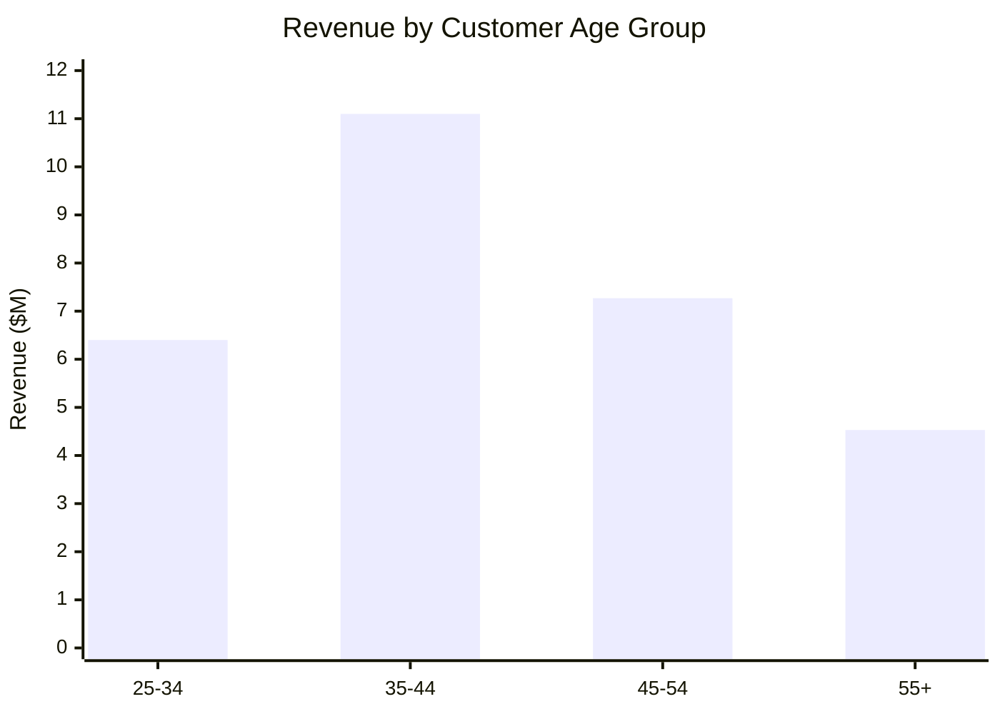

### Key Insight

The **35–44 age group generates the highest observed revenue**.

### Recommendation

Prioritize this segment for:

- Loyalty offers
- Premium products
- Accessory bundles
- Personalized recommendations

---

# 7. Customer Segmentation

Customer segmentation uses an RFM-style approach based on:

- **Recency** — how recently the customer purchased
- **Frequency** — how often the customer orders
- **Revenue** — how much revenue the customer generates

Scores range from **1 to 5**, with higher scores representing stronger customer value.

### Segments

| Segment | Business meaning | Recommended action |
|---|---|---|
| VIP | Strong recency, frequency and revenue | Loyalty rewards, early access, premium offers |
| High Value | Strong recent activity plus frequency/revenue | Upsell, cross-sell, loyalty conversion |
| Regular | Consistent purchasing | Increase frequency |
| Low Value | Lower combined value | Low-cost promotions and bundles |
| At Risk | Low recency but meaningful historical value | Win-back campaigns |
| Lost | Low recency, frequency and revenue | Reactivation only where economical |
| Cannot Conclude | Does not fit another rule | Review segmentation logic/data |

> **Important:** The provided segmentation output is customer-level data, not a complete aggregate of segment counts. Do not report segment percentages until counts are calculated from the complete customer population.

---

# 8. Customer Concentration

## Top 10 Customer Revenue Contribution

**Top 10 customers contribute only 0.45% of total revenue.**

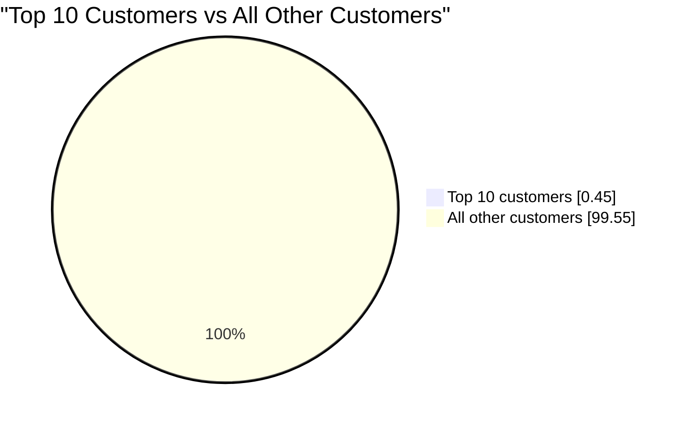

### Key Insight

Revenue is **not dependent on a small group of customers**.

This indicates:

- Low customer concentration risk
- Broad revenue distribution
- Less exposure to losing one major customer
- Strong opportunity for scalable customer-level growth

### Important distinction

The business has:

- **Low customer concentration:** Top 10 = 0.45%
- **Very high category concentration:** Bikes = 96.46%

These are different business risks.

---

# 9. Year-over-Year Revenue Trends

## 9.1 Category YOY

| Category | 2013 YOY Growth |
|---|---:|
| Bikes | **162.93%** |
| Accessories | **30,988.82%** |
| Clothing | **50,326.79%** |

The huge percentages for Accessories and Clothing are partly caused by very small prior-year bases.

### Interpretation

2013 shows major expansion across all three categories, but percentage growth alone should not be used to rank commercial importance.

---

## 9.2 Country YOY Growth in 2013

| Country | 2013 YOY Growth |
|---|---:|
| United States | **265.59%** |
| Canada | **252.90%** |
| United Kingdom | 197.66% |
| Germany | 189.45% |
| France | 143.15% |
| Australia | 103.86% |

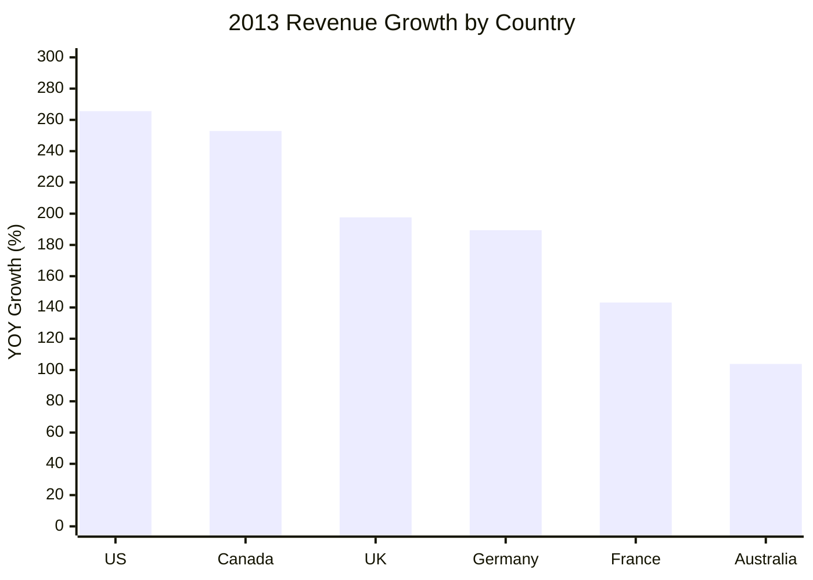

### Insight

**2013 was a strong growth year across every major market.**

---

# 10. Critical Data Quality Finding: 2014

The most important analytical caveat is **2014**.

Revenue falls dramatically in 2014 across almost every country:

- Australia: **-99.80%**
- Germany: **-99.81%**
- United Kingdom: **-99.83%**
- United States: **-99.68%**
- France: **-99.80%**
- Canada: **-99.13%**

Similar declines occur across categories, subcategories and products.

### Interpretation

These results strongly suggest that **2014 does not represent a complete comparable year**.

> **Do not interpret 2014 negative YOY percentages as genuine business declines until source-data coverage has been confirmed.**

### Tableau recommendation

Either:

1. Exclude 2014 from full-year YOY comparisons, **or**
2. Include it with a clear **"Partial Year"** annotation.

Recommended dashboard note:

> **2014 contains incomplete sales coverage and is excluded from full-year YOY interpretation.**

---

# 11. Product-Level YOY Interpretation

The product-level results contain very large growth percentages.

Examples include:

| Product | YOY Growth |
|---|---:|
| ML Mountain Tire | 108,500% |
| Mountain Tire Tube | 97,366.67% |
| Touring Tire Tube | 70,000% |
| Half-Finger Gloves - M | 47,300% |
| Patch Kit/8 Patches | 75,500% |

### Why these numbers can mislead

A product growing from $10 to $1,000 has a **9,900%** growth rate but remains much smaller than a product growing from $1M to $1.2M.

### Recommended product scorecard

Evaluate:

1. Revenue
2. Profit
3. Profit margin
4. YOY growth %
5. Absolute revenue change

This prevents products with tiny starting bases from dominating the analysis.

---

# 12. Strategic Business Recommendations

## Priority 1 — Protect the Bike Business

Bikes contribute **96.46% of revenue**.

Actions:

- Maintain availability of high-performing bike models
- Monitor bike inventory
- Protect pricing and margins
- Track Road, Mountain and Touring Bikes separately

---

## Priority 2 — Grow High-Margin Accessories

Accessories have a **62.79% margin**.

Actions:

- Bike + helmet bundles
- Bike + tire/tube bundles
- Bike + bottle/hydration bundles
- Post-purchase recommendations
- Checkout cross-sells

**Objective:** Increase accessory revenue without requiring proportional customer acquisition.

---

## Priority 3 — Focus on US and Australia

### United States
- Highest revenue
- Highest order volume
- Highest profit

### Australia
- Nearly as much revenue as the US
- Highest AOV
- Second-highest profit

Australia is particularly attractive for **premium and bundle-based offers**.

---

## Priority 4 — Retain the 35–44 Segment

The 35–44 age group generates the highest observed age-group revenue.

Use:

- Loyalty programs
- Premium offers
- Accessory bundles
- Personalized recommendations

---

## Priority 5 — Build Segment-Specific Retention

Prioritize:

**VIP → High Value → At Risk**

- VIP: retain and reward
- High Value: upsell and convert to VIP
- At Risk: win back before value is lost

---

## Priority 6 — Diversify Revenue Carefully

The business has low customer concentration but very high category concentration.

Therefore the primary diversification opportunity is:

> **Increase revenue from Accessories and Clothing while protecting the Bike core.**

---

# 13. Recommended Tableau Dashboard Structure

Good dashboards should emphasize the most important information first, remain uncluttered, provide context, and use chart types that match the analytical question.

## Dashboard 1 — Executive Overview

### KPI Cards

- Total Revenue
- Total Profit
- Profit Margin
- Total Orders
- Total Customers
- AOV

### Charts

1. Revenue Trend — **Line**
2. Revenue by Category — **Bar**
3. Revenue by Country — **Bar**
4. Profit by Category — **Bar**
5. Revenue Mix — **Bar/Donut**
6. Top Products — **Horizontal Bar**

---

## Dashboard 2 — Product Performance

### Charts

- Revenue by Category
- Revenue by Subcategory
- Profit by Subcategory
- Profit Margin by Category
- Top 10 Products
- YOY Product Growth

### Drill-down

`Category → Subcategory → Product`

---

## Dashboard 3 — Customer Intelligence

### Charts

- Revenue by Gender
- Orders by Gender
- AOV by Gender
- Revenue by Age Group
- Revenue by Country
- Customer Segmentation
- Top Customer Contribution

### Drill-down

`Country → Customer Segment → Customer`

---

## Dashboard 4 — Growth & Trends

### Charts

- Category YOY Growth
- Subcategory YOY Growth
- Country YOY Growth
- Product YOY Growth

### Important filter

**Year**

Add an explicit warning/annotation for 2014.

---

# 14. Recommended Insight-Oriented Chart Titles

| Generic title | Better business title |
|---|---|
| Sales by Category | **Bikes Drive 96% of Revenue** |
| Profit by Category | **Bikes Generate the Majority of Profit** |
| Category Margin | **Accessories Deliver the Highest Margin** |
| Sales by Country | **US and Australia Lead Revenue** |
| AOV by Country | **Australia Has the Highest Average Order Value** |
| Sales by Age | **Customers Aged 35–44 Generate the Most Revenue** |
| Customer Concentration | **Top 10 Customers Contribute Only 0.45% of Revenue** |
| YOY Growth | **2013 Delivered Strong Growth Across Major Markets** |

Insight-led titles help the dashboard communicate the business story rather than merely displaying field names.

---

# 15. Data Quality & Analytical Caveats

### 1. 2014 appears incomplete

Extreme negative YOY values across almost every market/category indicate incomplete year coverage.

### 2. `n/a` customer attributes exist

Examples include:

- Gender
- Country

Keep these visible for data-quality monitoring.

### 3. Very high percentage growth can be misleading

Products/categories with tiny previous-year revenue can produce enormous YOY percentages.

Always pair:

**Growth % + Absolute Revenue + Profit**

### 4. Age calculations use a historical analysis date

The customer age-group query uses:

```sql
'2014-01-28'
```

For reproducible reporting, define and document an explicit analysis cutoff date.

### 5. Customer and category concentration are different

- Customer concentration is low.
- Category concentration is extremely high.

This distinction should appear in the executive narrative.

---

# 16. Executive Action Plan

| Priority | Action | Business Objective |
|---|---|---|
| 🔴 High | Protect Bike availability | Protect core revenue |
| 🔴 High | Increase accessory attach rate | Improve margin and basket size |
| 🔴 High | Retain US/Australia customers | Protect largest markets |
| 🟠 Medium | Target 35–44 customers | Grow highest-value age segment |
| 🟠 Medium | Launch At Risk win-back campaigns | Reduce customer churn |
| 🟠 Medium | Develop Clothing/Accessories | Reduce category concentration |
| 🟢 Monitor | Track customer concentration | Maintain diversified customer base |
| 🟢 Monitor | Validate 2014 source coverage | Prevent misleading YOY reporting |

---

# 17. Final Business Story

> **Bikes are the core engine, generating 96.46% of revenue and the majority of profit.**

> **Accessories are the hidden profitability opportunity, with a 62.79% margin but only 2.38% of revenue.**

> **The US and Australia are the priority markets. The US leads revenue, orders and profit, while Australia combines high revenue with the highest AOV.**

> **The customer base is broadly diversified: the top 10 customers account for only 0.45% of revenue.**

> **Customers aged 35–44 are the strongest observed revenue segment.**

> **2013 was a strong growth year, while 2014 should be treated cautiously because the data appears incomplete.**

---

# 18. Portfolio Takeaway

This project demonstrates more than SQL aggregation. It connects:

**Data Warehouse → Dimensional Model → SQL Analytics → Customer Segmentation → Profitability → Business Insights → Tableau Storytelling**

A strong portfolio statement is:

> **"Built an end-to-end retail analytics platform that transforms transactional data into actionable insights across revenue, profitability, products, geography, customer behavior, segmentation and growth, while identifying data-quality limitations that could otherwise lead to incorrect business conclusions."**

---

## Methodology

All numerical findings in this document are derived from the Gold-layer SQL outputs provided for the Retail Analytics Intelligence Platform.

Dashboard recommendations emphasize visual hierarchy, contextual metrics, appropriate chart selection and actionable storytelling rather than maximizing the number of visuals.


## Customer Segmentation — RFM Analysis

| Customer Segment | Customers | Share |
|---|---:|---:|
| At Risk | 5,190 | 28.1% |
| High Value | 4,466 | 24.2% |
| Regular | 3,688 | 20.0% |
| VIP | 2,936 | 15.9% |
| Low Value | 2,202 | 11.9% |
| **Total** | **18,482** | **100%** |

### Customer Segment Distribution

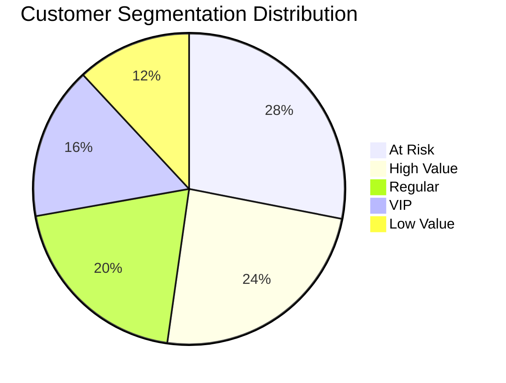

### Key Insights

- **At Risk is the largest segment:** 5,190 customers (28.1%). This is the biggest retention and win-back opportunity.
- **High Value:** 4,466 customers (24.2%) are already commercially important and should be protected through retention and upsell strategies.
- **Regular:** 3,688 customers (20.0%) form a strong pool for increasing purchase frequency and moving customers toward High Value.
- **VIP:** 2,936 customers (15.9%) should receive the strongest loyalty and personalized-retention efforts.
- **Low Value:** 2,202 customers (11.9%) can be developed through cross-selling, bundles and basket-size growth.
- **At Risk + High Value = 9,656 customers (52.2%)**, making these two groups the most strategically important segments.
- No customers were classified as **Lost** or **Cannot Conclude** in this output.

### Recommended Actions

| Segment | Objective | Action |
|---|---|---|
| VIP | Retain | Exclusive rewards, early access and personalized offers |
| High Value | Retain & grow | Upsell, cross-sell and loyalty benefits |
| Regular | Develop | Frequency campaigns, bundles and targeted promotions |
| Low Value | Activate | Entry-level offers and complementary-product recommendations |
| At Risk | Win back | Re-engagement, personalized incentives and targeted win-back campaigns |

> **RFM snapshot date:** `2014-01-28`. Recency is measured as the number of days since each customer's most recent order relative to this date.
